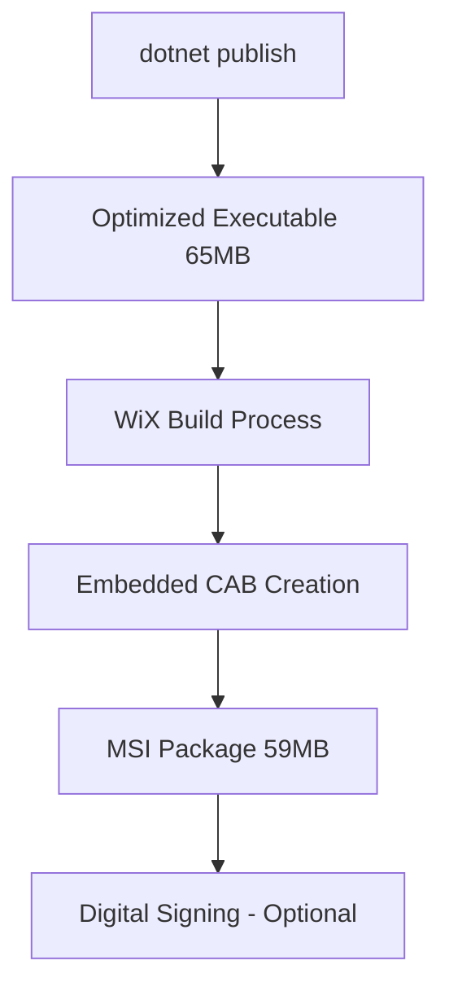

# MSI Installer Development Guide

## 🔧 Installer Architecture

### **WiX Toolset v5 Configuration**
The installer uses modern WiX v5 syntax with embedded CAB for single-file distribution.

### **Build Process Flow**


### **Key Files**
- `CybageMISAutomation.wxs` - WiX installer definition
- `BuildMSI.ps1` - Automated build script
- `cybageLogo.png` - Application icon for shortcuts

### **Installation Structure**
```
Program Files\
└── Cybage Technology Group\
    └── MIS Report Automation\
        ├── CybageMISAutomation.exe (65MB)
        ├── config.json
        └── cybageLogo.png
```

## 🚀 Building Installers

### **Quick Build**
```powershell
# Standard build with clean
.\BuildMSI.ps1 -Clean

# Skip application build (use existing)
.\BuildMSI.ps1 -SkipBuild

# Debug configuration
.\BuildMSI.ps1 -Configuration Debug
```

### **Build Script Parameters**
- `-Configuration` - Release (default) or Debug
- `-SkipBuild` - Skip dotnet publish step
- `-Clean` - Remove previous build artifacts

### **Output Files**
- `CybageMISAutomation-Setup-v[DATE].msi` - Main installer
- `*.wixpdb` - Debug symbols (safe to delete)

## 📦 Size Optimizations Applied

### **Application Level** (in .csproj)
```xml
<!-- Compression and optimization -->
<EnableCompressionInSingleFile>true</EnableCompressionInSingleFile>
<PublishSingleFile>true</PublishSingleFile>
<SatelliteResourceLanguages>en</SatelliteResourceLanguages>

<!-- Release-specific settings -->
<PropertyGroup Condition="'$(Configuration)' == 'Release'">
  <DebugType>none</DebugType>
  <DebugSymbols>false</DebugSymbols>
</PropertyGroup>
```

### **MSI Level** (in .wxs)
```xml
<!-- High compression CAB embedded in MSI -->
<Media Id="1" Cabinet="app.cab" EmbedCab="yes" CompressionLevel="high" />

<!-- Minimal component structure -->
<ComponentGroup Id="AppFiles">
  <!-- Only essential files: EXE, config, logo -->
</ComponentGroup>
```

## 🔍 Testing & Validation

### **Pre-Release Checklist**
- [ ] Application builds without errors
- [ ] Logo displays correctly in UI
- [ ] MSI installs successfully
- [ ] Start Menu shortcut works
- [ ] Desktop shortcut works (optional)
- [ ] Application starts and loads config
- [ ] Uninstall removes all files

### **Test Commands**
```powershell
# Test installation (as Administrator)
msiexec /i "CybageMISAutomation-Setup-v[DATE].msi" /quiet

# Test uninstallation
msiexec /x "CybageMISAutomation-Setup-v[DATE].msi" /quiet

# Interactive installation
msiexec /i "CybageMISAutomation-Setup-v[DATE].msi"
```

## 🔧 Troubleshooting

### **Common Build Issues**

1. **WiX not found**
   ```
   Solution: Install WiX Toolset v5 from GitHub releases
   ```

2. **Logo file missing**
   ```
   Error: Icon stream is not in the expected format
   Solution: Ensure cybageLogo.png exists in project root
   ```

3. **Executable not found**
   ```
   Error: Source file not found
   Solution: Run dotnet publish first or use -SkipBuild flag correctly
   ```

### **MSI Validation**
```powershell
# Check MSI contents
msiexec /a "installer.msi" TARGETDIR="C:\temp\extract" /quiet

# Validate MSI structure
# Use Orca tool or InstallShield validation
```

## 📋 Customization Options

### **Branding Updates**
```xml
<!-- Update company information in .wxs -->
<Package Name="Your App Name" 
         Manufacturer="Your Company" 
         Version="1.0.0.0" />

<!-- Update icon reference -->
<Icon Id="AppIcon" SourceFile="..\yourLogo.png" />
```

### **Installation Directories**
```xml
<!-- Modify installation path -->
<Directory Id="CompanyFolder" Name="Your Company Name">
  <Directory Id="INSTALLFOLDER" Name="Your App Name" />
</Directory>
```

### **Feature Selection**
```xml
<!-- Add optional components -->
<Feature Id="DesktopShortcut" Title="Desktop Shortcut" Level="2">
  <ComponentRef Id="DesktopShortcut" />
</Feature>
```

## 🚀 Advanced Features

### **Upgrade Handling**
```xml
<!-- Add upgrade detection -->
<MajorUpgrade DowngradeErrorMessage="A newer version is already installed." />
```

### **Custom Actions**
```xml
<!-- Add post-install actions -->
<CustomAction Id="CreateLogDirectory" 
              Directory="INSTALLFOLDER" 
              ExeCommand="mkdir logs" />
```

### **Registry Integration**
```xml
<!-- Add registry entries -->
<Component Id="RegistryEntries">
  <RegistryKey Root="HKLM" Key="Software\YourCompany\YourApp">
    <RegistryValue Name="InstallPath" Value="[INSTALLFOLDER]" Type="string" />
  </RegistryKey>
</Component>
```

---

*MSI Installer built with WiX Toolset v5 - Professional Windows Installation Experience*