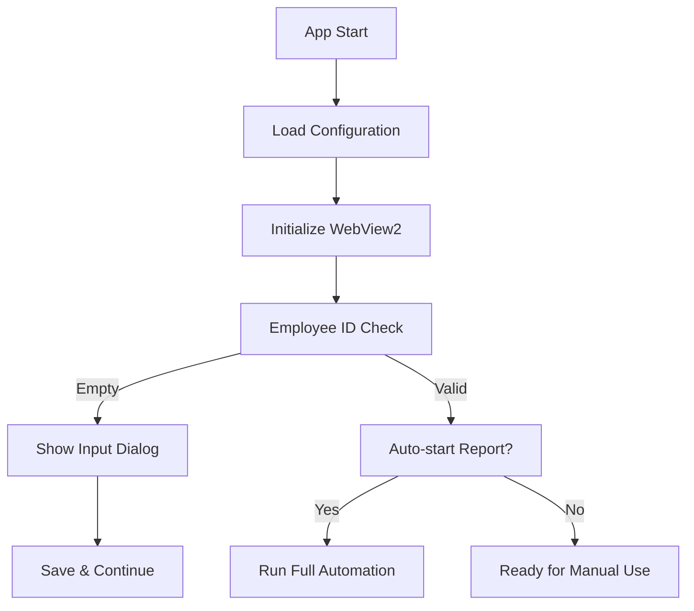

<<<<<<< HEAD
# Cybage MIS Report Automation

A streamlined WPF application for automating MIS report generation and calendar visualization at Cybage Technology Group.


Download the MSI installer package for Windows - https://github.com/ramp-cyb/WorkHours/raw/refs/heads/master/CybageMISAutomation/Installer/CybageMISAutomation-AllFiles-v20250930.msi

Or downlooad the Zip 

Download the MSI installer package for Windows - https://github.com/ramp-cyb/WorkHours/raw/refs/heads/master/CybageMISAutomation/Installer/CybageMISAutomation-v20250930.zip


## 🚀 Quick Start

### Prerequisites
- **.NET 8.0 SDK** (Windows)
- **Visual Studio 2022** or **VS Code** with C# extension
- **WiX Toolset v5** (for MSI installer creation)
- **Windows 10/11** (WebView2 dependency)

### Clone & Build
```bash
# Clone the repository
git clone https://github.com/ramp-cyb/WorkHours.git
cd WorkHours/CybageMISAutomation

# Build the application
dotnet build

# Run in development
dotnet run

# Create optimized release build (65MB vs 163MB)
dotnet publish -c Release -r win-x64 --self-contained true
```

### Create MSI Installer
```powershell
# Navigate to installer directory
cd Installer

# Build optimized MSI (59MB package)
.\BuildMSI.ps1 -Clean
```

## 📁 Project Structure

```
CybageMISAutomation/
├── 📁 Models/                  # Data models and configuration
│   ├── AppConfig.cs           # Application configuration
│   ├── SwipeLogEntry.cs       # Swipe log data model
│   ├── WorkHoursCalculation.cs # Work hours calculation model
│   └── DayCalendarItem.cs     # Calendar day representation
├── 📁 Services/               # Business logic and data processing
│   ├── ConfigurationService.cs # Config file management
│   └── FullReportBuilder.cs   # Calendar report generation
├── 📁 Views/                  # UI dialogs and windows
│   ├── EmployeeIdInputDialog.* # Employee ID input popup
│   ├── FullReportWindow.*     # Monthly calendar display
│   ├── LogWindow.*            # Debug logging window
│   └── MonthlyWindow.*        # Monthly report viewer
├── 📁 Installer/              # MSI creation scripts
│   ├── CybageMISAutomation.wxs # WiX installer configuration
│   ├── BuildMSI.ps1           # Automated build script
│   └── README.md              # Installer documentation
├── MainWindow.*               # Primary application interface
├── cybageLogo.png            # Company branding
└── config.json              # Runtime configuration
```

## 🔧 Key Features & Architecture

### 🎯 **Core Functionality**

1. **Automated MIS Navigation**
   - WebView2-based browser automation
   - Windows authentication integration
   - Dynamic form interaction

2. **Data Extraction & Processing**
   - Real-time swipe log parsing
   - Work hours calculation
   - Multi-day data aggregation

3. **Calendar Visualization**
   - Monthly calendar grid display
   - Color-coded work hours (Red <40h, Green 40-45h, Blue 45h+)
   - Weekly totals summary

4. **Configuration Management**
   - Persistent JSON-based settings
   - Employee ID auto-save
   - Auto-start functionality

## 🏗️ Application Flow

### 🚦 **Startup Sequence**


### 📊 **Report Generation Flow**


## 🔑 Key Methods & Functions

### **MainWindow.xaml.cs** - Primary Controller (3,429 lines)

#### 🌟 **Critical Methods**

1. **`HandleAutoStartWithEmployeeIdValidation()`** *(Lines 1883-1924)*
   ```csharp
   // Validates employee ID before auto-start
   // Shows popup dialog if ID is missing
   // Saves ID and proceeds with automation
   ```

2. **`RunFullCalendarAutomation()`** *(Lines 3046-3074)*
   ```csharp
   // Main automation orchestrator
   // Sequence: Monthly → Today → Yesterday → Calendar
   // Handles all data aggregation
   ```

3. **`SelectEmployeeFromDropdown()`** *(Lines 2065-2255)*
   ```csharp
   // Dynamic employee selection using WebView2
   // Searches dropdown options by employee ID
   // Handles MIS form interactions
   ```

4. **`ExtractSwipeDataFromTable()`** *(Lines 2758-2900)*
   ```csharp
   // Parses HTML table data into structured objects
   // Converts time strings to TimeSpan objects
   // Calculates work hours and breaks
   ```

### **FullReportBuilder.cs** - Calendar Logic

#### 🗓️ **Calendar Generation**

1. **`Build()`** *(Main method)*
   ```csharp
   // Combines monthly, today, and yesterday data
   // Creates calendar grid structure
   // Applies color coding logic
   ```

2. **Color Coding Logic**:
   - **Red**: < 40 hours/week
   - **Green**: 40-45 hours/week  
   - **Blue**: 45+ hours/week
   - **Gray**: No data available

### **ConfigurationService.cs** - Settings Management

#### ⚙️ **Configuration Handling**

1. **`LoadConfigurationAsync()`**
   ```csharp
   // Loads settings from config.json
   // Creates default config if missing
   // Handles JSON deserialization errors
   ```

2. **`SaveConfigurationAsync()`**
   ```csharp
   // Persists settings to config.json
   // Thread-safe configuration updates
   // Auto-save on employee ID changes
   ```

## 🎨 UI Components

### **Employee ID Validation**
- **Purpose**: Ensures valid employee ID before automation
- **Trigger**: Auto-start with empty employee ID
- **Flow**: Popup → Validation → Save → Continue

### **Calendar Display** *(FullReportWindow)*
- **Size**: 60% of desktop (optimized from maximized)
- **Grid**: 7 days × 6 weeks + weekly totals column
- **Styling**: Professional color scheme with rounded corners

### **Logo Integration**
- **Location**: Top-left header with light blue background
- **Format**: PNG with transparent background
- **Visibility**: Enhanced with `#BBDEFB` background container

## 📦 Build Optimizations

### **Size Reduction Achievements**
| Component | Before | After | Reduction |
|-----------|--------|--------|-----------|
| Executable | 163.9 MB | 65.3 MB | **60%** |
| MSI Package | ~162 MB | 59.1 MB | **63%** |
| File Count | 200+ files | 3 files | **99%** |

### **Optimization Techniques**
1. **Single-file publishing** with compression
2. **Debug symbol removal** in release builds
3. **Language pack exclusion** (English only)
4. **Embedded CAB** in MSI installer
5. **Resource optimization** and trimming

## ⚡ Performance Features

### **WebView2 Integration**
- **Security**: Disabled web security for internal MIS access
- **Authentication**: Automatic Windows authentication
- **Navigation**: Programmatic form interaction
- **Error Handling**: Robust timeout and retry logic

### **Async Operations**
- **Non-blocking UI**: All automation runs asynchronously
- **Progress Feedback**: Real-time status updates
- **Cancellation Support**: User can interrupt operations

## 🔐 Security Considerations

### **Current Implementation**
- ⚠️ WebView2 runs with `--disable-web-security` flag
- ⚠️ No URL validation for navigation


### **Recommended Improvements**
- Add URL whitelist validation
- Enable proper HTTPS certificate validation
- Add request/response logging for audit trails

## 🚀 Deployment

### **MSI Installer Features**
- **Company**: Cybage Technology Group
- **Installation**: Program Files structure
- **Shortcuts**: Start Menu + Desktop with logo
- **Uninstall**: Clean removal support
- **Version**: Date-based versioning (v20250929)

### **Distribution**
```powershell
# Create production build
.\BuildMSI.ps1 -Configuration Release -Clean

# Output: CybageMISAutomation-Setup-v[DATE].msi
# Size: ~59MB (single-file distribution)
```

## 🐛 Debugging & Logs

### **Log Window**
- **Toggle**: Checkbox in main interface
- **Content**: Real-time automation progress
- **Levels**: Info, Warning, Error messages
- **Persistence**: Session-based (not saved to file)

### **Common Issues**
1. **WebView2 Initialization**: Requires Windows 10+
2. **Employee ID**: Must match MIS dropdown format
3. **Network**: Requires access to cybagemis.cybage.com
4. **Authentication**: Uses current Windows user credentials

## 📈 Future Enhancements

### **Planned Features**
- [ ] Export calendar to PDF/Excel
- [ ] Email report automation
- [ ] Multi-employee batch processing
- [ ] Historical data storage
- [ ] Advanced filtering and search

### **Technical Debt**
- [ ] Split 3,429-line MainWindow class
- [ ] Replace Task.Delay with proper event handling
- [ ] Add comprehensive unit tests
- [ ] Implement proper logging framework
- [ ] Add error recovery mechanisms

## 🤝 Contributing

### **Development Setup**
1. Fork the repository
2. Create feature branch: `git checkout -b feature/my-feature`
3. Follow existing code style and patterns
4. Test MSI build process before submitting
5. Submit pull request with detailed description

### **Code Style**
- Use async/await patterns for I/O operations
- Follow Microsoft C# coding conventions  
- Add XML documentation for public methods
- Include error handling for all external operations

## 📞 Support

For technical support or questions:
- **Internal**: Contact Cybage IT Support
- **Developer**: See inline code documentation
- **Issues**: Use GitHub issue tracker

---

*Built with ❤️ for Cybage Technology Group - Streamlining MIS reporting workflows*
=======
# Developer Quick Start Guide

## 🎯 5-Minute Setup

### **Clone & Run**
```bash
git clone https://github.com/ramp-cyb/WorkHours.git
cd WorkHours/CybageMISAutomation
dotnet run
```

### **First Time Setup**
1. App will prompt for Employee ID
2. Enter your MIS employee ID
3. WebView2 will initialize automatically
4. Ready for automation!

## 🔧 Development Environment

### **Required Tools**
```powershell
# Install .NET 8.0 SDK
winget install Microsoft.DotNet.SDK.8

# Install VS Code with C# extension
winget install Microsoft.VisualStudioCode
code --install-extension ms-dotnettools.csharp
```

### **Optional Tools**
```powershell
# For MSI building
winget install WiXToolset.WiX

# For advanced debugging
winget install Microsoft.VisualStudio.2022.Community
```

## 🚀 Key Development Commands

### **Build & Test**
```bash
# Debug build
dotnet build

# Run with live reload
dotnet watch run

# Release build (optimized)
dotnet publish -c Release -r win-x64 --self-contained true

# Create MSI installer
cd Installer && .\BuildMSI.ps1
```

### **Code Structure to Know**
- `MainWindow.xaml.cs` - Main app logic (focus here)
- `FullReportWindow.xaml.cs` - Calendar display
- `Services/ConfigurationService.cs` - Settings management
- `Models/` - Data structures

## 🐛 Debugging Tips

### **Common Issues**
1. **WebView2 won't load**: Restart as Administrator
2. **Employee ID not found**: Check MIS dropdown format
3. **Build fails**: Clean and rebuild solution

### **Debug Mode**
- Enable "Show Log Window" checkbox
- Watch console output for automation steps
- Check `config.json` for saved settings

## 📝 Making Changes

### **UI Modifications**
- Edit `.xaml` files for visual changes
- Modify `.xaml.cs` files for behavior changes
- Test with `dotnet run` immediately

### **Adding Features**
1. Create new method in appropriate class
2. Add UI controls if needed
3. Wire up event handlers
4. Test automation flow

### **Performance Notes**
- Avoid `Task.Delay()` - use proper async patterns
- Cache MIS data when possible
- Update UI on main thread only

- Download it from Installer folder - https://github.com/ramp-cyb/WorkHours/blob/master/CybageMISAutomation/Installer/CybageMISAutomation-AllFiles-v20250929.msi

---

*Happy coding! 🚀 Remember to test MSI builds before releases.*
>>>>>>> 992dce70853c3de7ed61d144bd19d326bb8a6e1c
